# Mermaid

## Orientation

`TD`
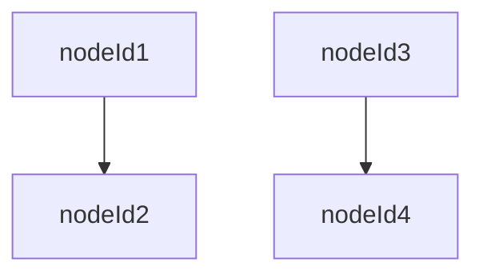

---
`LR`
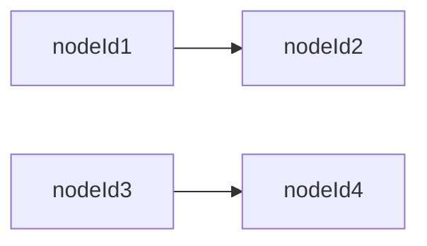

---

`RL`
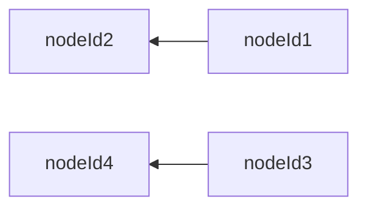

## Node Text

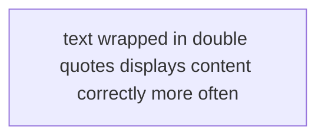

## Comments

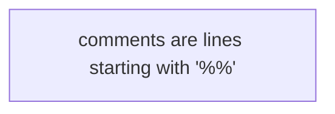

## Node Shape

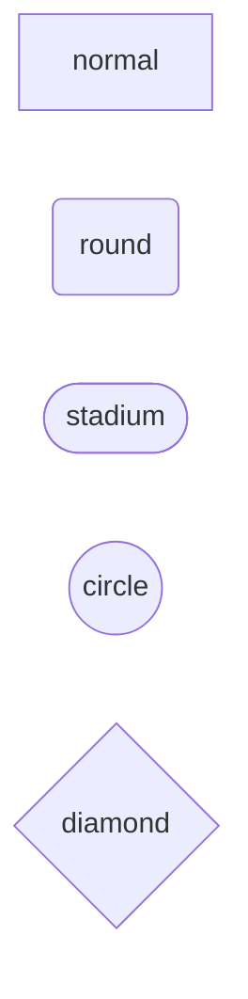

## Edge Arrows

### Arrow Types

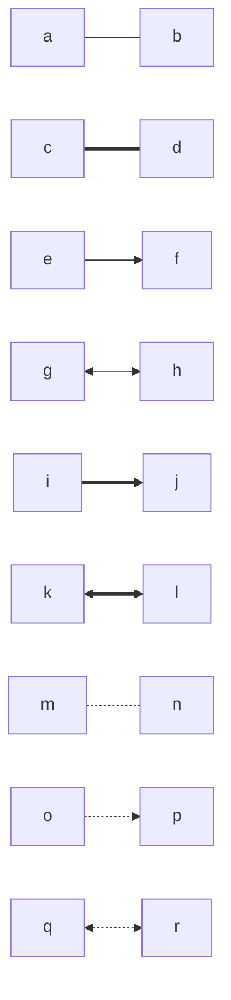

### Arrow Length

Shorter arrows appear earlier than longer arrows...

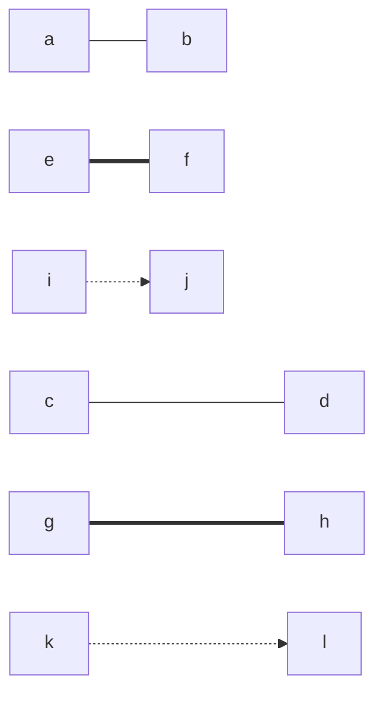

## Edge Text

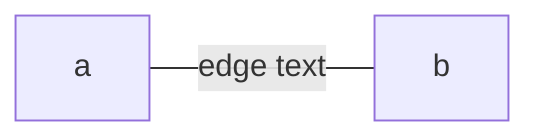

## Multiple Edges

### To the same node

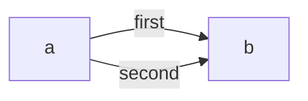

### Between multiple nodes

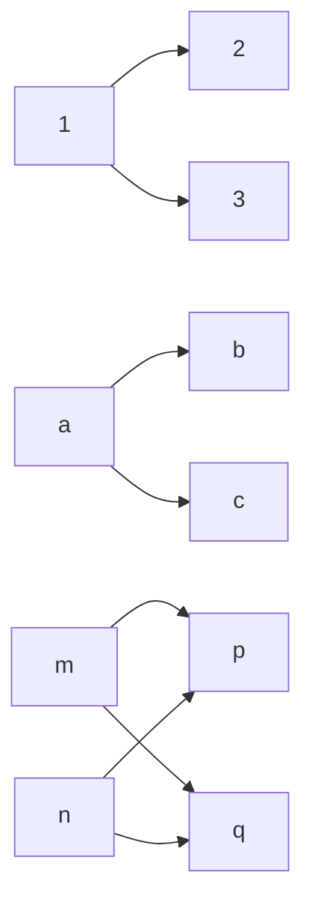

## Styling

I won't expore this yet until I need it.

## Subgraphs

### Basic

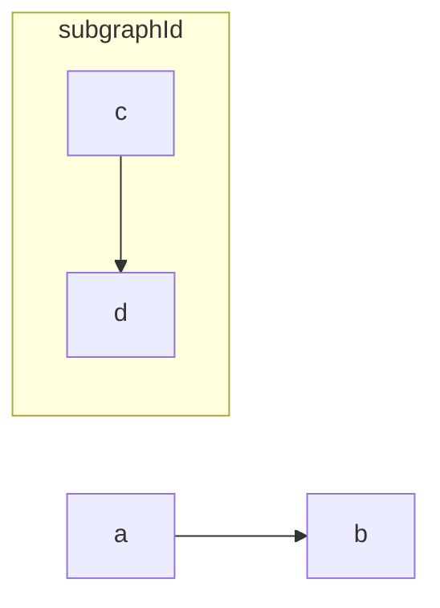

### Subgraph Text

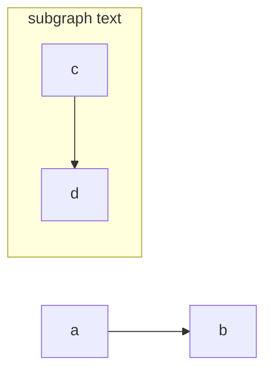

### Subgraph Links

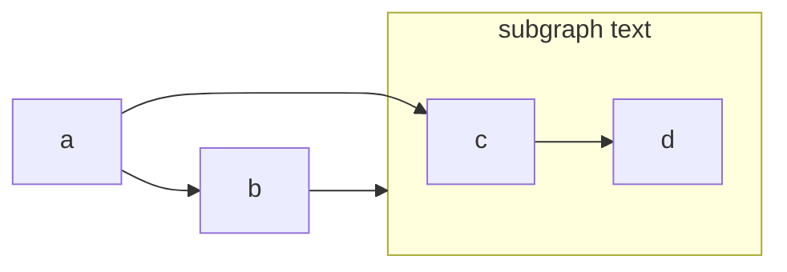

### Subgraph Direction

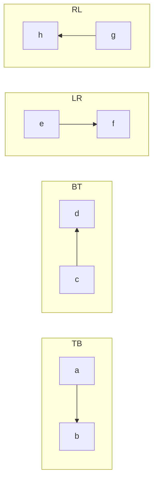